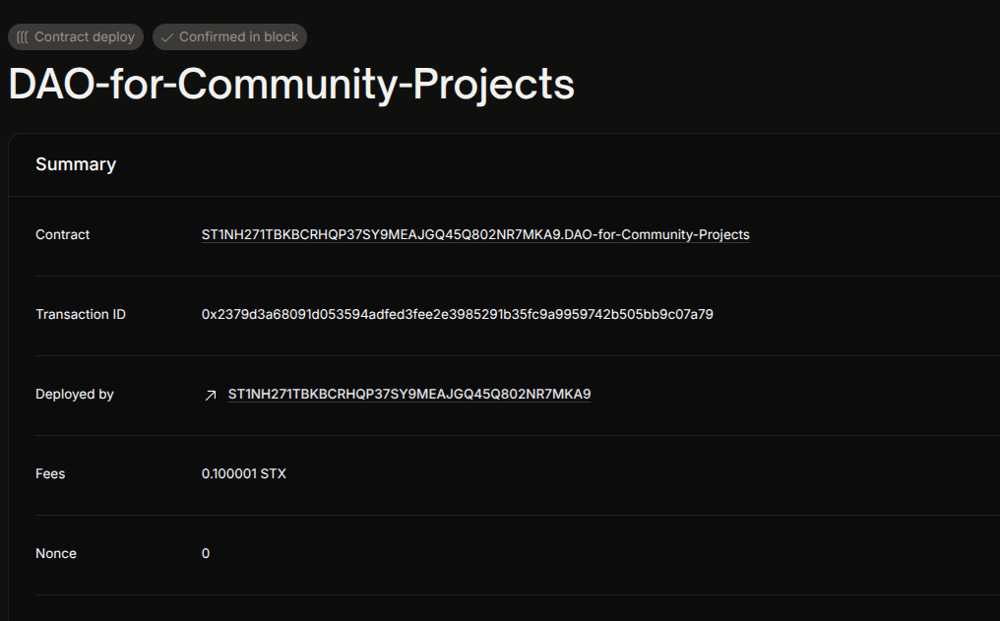

# Project Title
DAO for Community Projects

## Project Description
A decentralized autonomous organization (DAO) contract that enables community members to submit project proposals and vote on them. Voting power is equal for all members, allowing collective decision-making and transparent governance.

## Project Vision
To empower community-driven initiatives by decentralizing governance and funding decisions, ensuring fairness and transparency in project selection and resource allocation.

## Future Scope
- Add member management (add/remove members)
- Implement quorum and proposal execution logic
- Introduce token-weighted voting
- Integrate treasury and fund disbursement mechanisms

## Contract Address
ST1NH271TBKBCRHQP37SY9MEAJGQ45Q802NR7MKA9.DAO-for-Community-Projects

